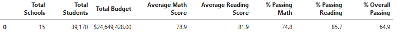
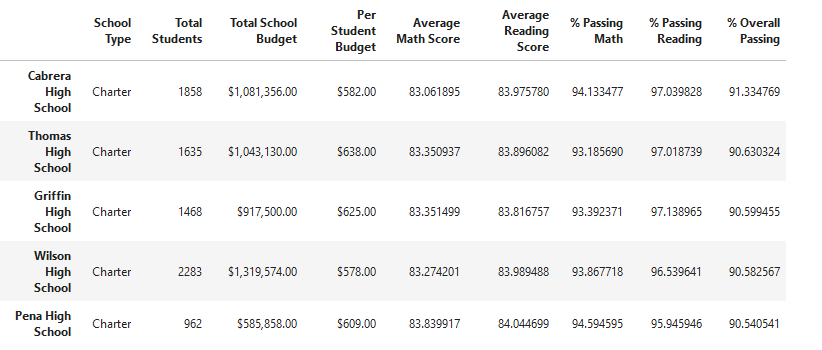
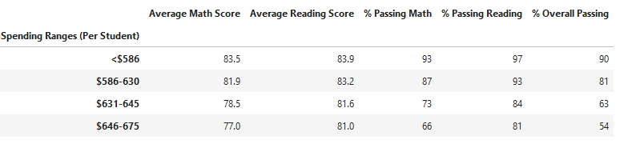
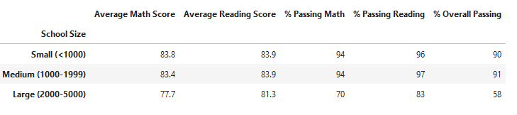
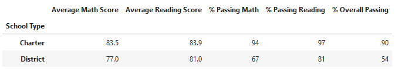

# School_District_Analysis
## Overview of the School District Analysis
The analysis looks at the data of schools across the district in terms of their reading and math scores, while comparing this data to factors such as school type, school size, and school budget. For this analysis, I first calculated the averages of students who passed their math and reading scores at each school, then compared schools to each other using percentages of overall passing scores. Unfortunately, due to an issue with academic dishonesty, it was necessary to remove the 9th grade reading and math scores for Thomas High School then redo the analysis with an adjusted set of data. 

## Results

### District Summary
Prior to removing Thomas High School’s 9th grade reading and math scores, the district summary showed an overall passing percentage of 65%. The new district summary now shows an overall passing percentage of 64.9, a slight decrease. The percentage of students who passed reading and math also decreased by 0.1%, as did the average math score. 

)

### School Summary
The top 5 schools did not change after removing Thomas High School’s 9th grade scores, nor did the bottom 5 schools. Although Thomas High School’s overall passing percentage dropped from 90.94 to 90.63, it remained in second place, above the 90.59 of the third school. 

Relative to the other schools, Thomas High School is still performing at a higher overall rate, although not as high as before removing the 9th grade scores. 

### Effect of Replacing 9th Grade Scores
Replacing Thomas High School’s 9th grade scores affects the following:
- Math and Reading scores by grade are affected because Thomas High School no longer has data for the 9th grade while all the other schools still do. 
- Scores by school spending still round out to the same numbers across the spending bins.

- Scores by school size still round out to the same numbers across the three size categories. 

- Scores by school type still round out to the same numbers across the two categories. 

## Summary of Changes
Due to removing 9th grade math and reading scores for Thomas High School, we see the following changes when analyzing the data: 

1. The overall percentage of passing students in the district went from 65.2% to 64.9%.

2. The percentage of students with passing reading scores across the district decreased from 85.8% to 85.7%.

3. The percentage of students with passing math scores across the district decreased from 75% to 74.8%. 

4. The average math score across the district decreased from 79% to 78.9%.
